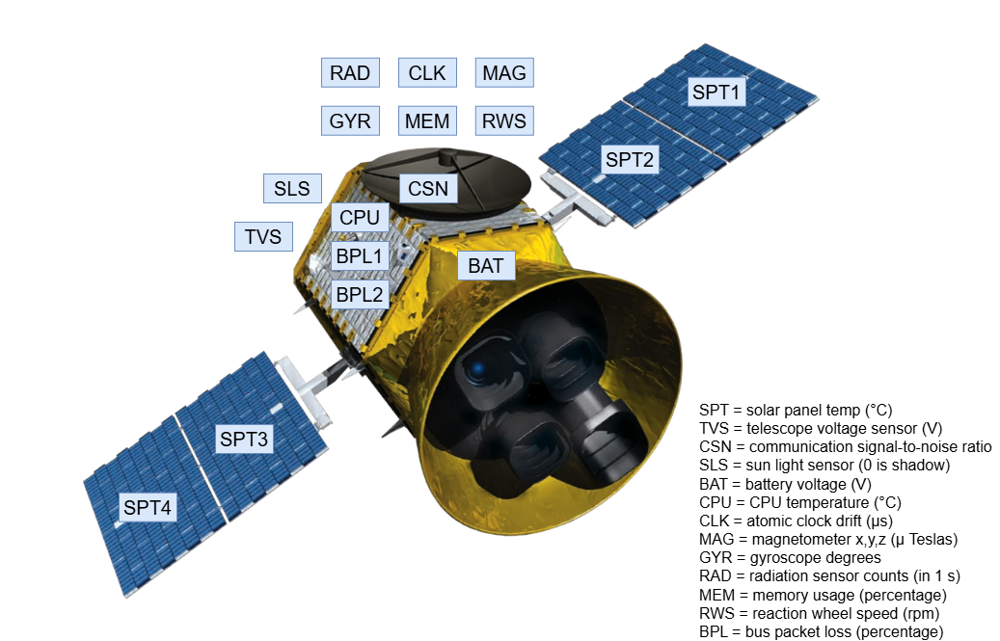
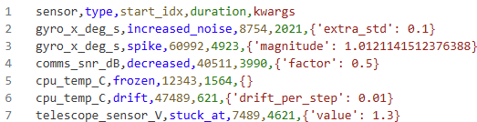
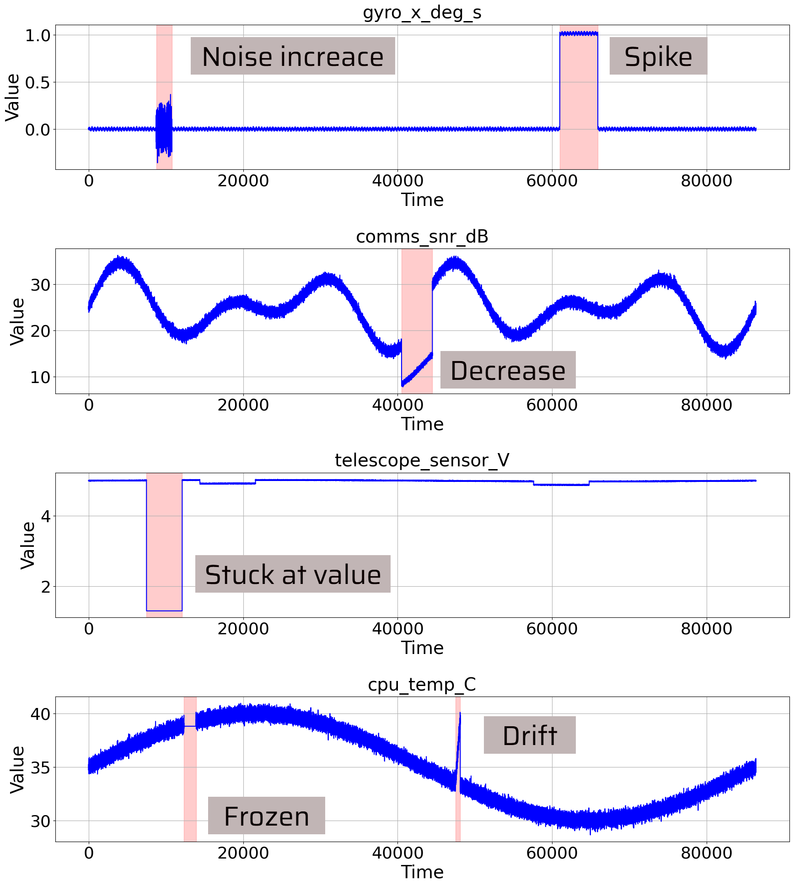

# Satellite telemetry generator with annotated anomalies

Python based synthetic satellite telemetry generator. The generator can generate signals of 13 different sensors (20 features at all, some sensors are duplicated, see image below). The generator injects anomalies in the signals randomly or based on the anomaly plan. Program can generate and inject two types of anomalies: **sensors failures** and **environment-based anomalies**. Sensor specific anomalies are affecting only one sensor at the time. They can use 6 different variations of signal disortion:

- signal spike
- stuck of signal at value X
- signal drift
- noise increase
- signal froze (at current value)
- rapid decrease of signal values

Visualization of those disortions can be seen in image below in **Example section**. Second type, environmental-based anomalies, affect multiple sensors at one timestamp. They are generated using the same set of signal disortions like sensor specific anomalies.
Environmental anomalies included in the generator are:

- solar storm
- Earth eclipse
- reaction wheel imbalance
- software fault/memory leak
- telescope overload

List of used sensors is presented in the following image. Telemetry signal flows of teose sensors have been designed based on the information found on online.



## Instalation

The development was carried out using **Python 3.12**.

    python -m venv venv
    source venv/bin/activate
    pip install -r requirements.txt


## Usage

Full available options are:

    python sat_telemetry_gen.py [-h] [--days DAYS] [--hz HZ] [--seed SEED]  [--out OUT] [--cycles_per_day CYCLES_PER_DAY] [--auto_anomalies AUTO_ANOMALIES] [--env_anomalies ENV_ANOMALIES] [--use_plan USE_PLAN]

where:
 - ```-h``` shows **help**
 - ```--days``` sets the number of days for which the generator should produce telemetry
 - ```--hz``` sets the generation frequency  (1 Hz = 1 s)
 - ```--seed``` sets the random seed value
 - ```--out``` sets the output file path (.csv)
 - ```--cycles_per_day``` sets the number of cycles around the Earth that the satellite should make (this influences the sunlight values included in the signal generation of some sensors)
 - ```--auto_anomalies``` sets how many **sensor-specific** anomalies should be generated
 - ```--env_anomalies``` sets the number of **environmental-based** anomalies to be generated (1 means that all environmental anomalies will be included once in whole dataset)
 - ```--use_plan``` if set, the previous two arguments are ignored and anomalies are generated based on the anomaly plan **csv** file


## Example

Example of random telemetry generation with 15 sensor-specific anomalies and one pack of environmental anomalies for one day with frequency of 1 Hz:

    python sat_telemetry_gen.py --days 1 --hz 10 --seed 42 --cycles_per_day 2 --auto_anomalies 15 --env_anomalies 1 --out generated_telemetry.csv
----
Example of generating telemetry based on plan. Anomaly plan csv file is shown in the figure below and also in the file *example_anomaly_plan.csv*. Anomaly plan includes all variations of anomaly signal disortions.




Generating telemetry using plan:

    python sat_telemetry_gen.py --days 1 --hz 1 --cycles_per_day 6 --out example_telemetry.csv --use_plan example_anomaly_plan.csv

The picture below shows what the generated telemetry, including the anomalies, looks like. All types of anomaly are labelled in the figure. 



## Citation

If you use this generator, please use following citation in your work:

```bibtex
@misc{satellite_telemetry_generator,
    title    = {Satellite telemetry generator with annotated anomalies},
    author   = {Vojtěch Orava},
    date     = {2026},
    url      = {https://github.com/vorava/satellite_telemetry_generator},
}
```

## License

[MIT License](https://github.com/vorava/satellite_telemetry_generator/blob/main/LICENSE)